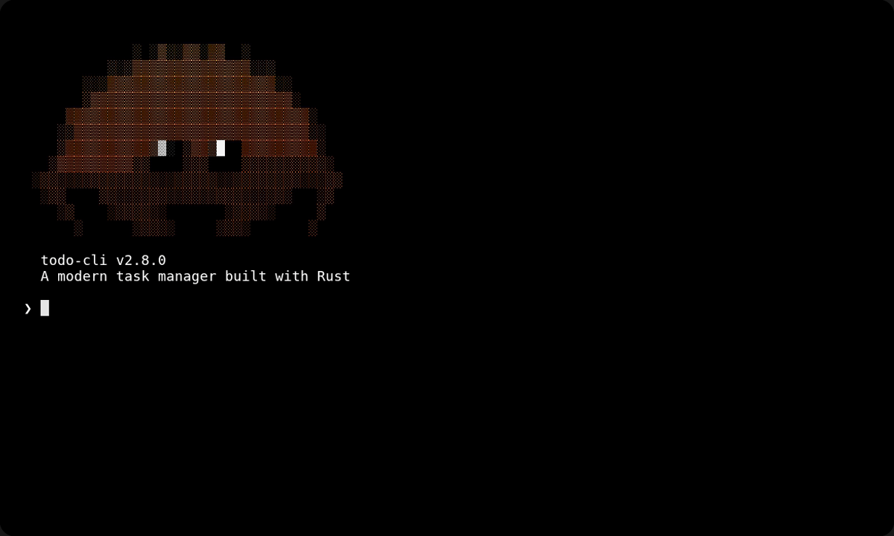

<p align="center">
    
    <br>
    <a href="https://github.com/joaofelipegalvao/rustodo/releases">
        </a>
    <a href="https://crates.io/crates/rustodo">
        </a>
    <br>
    <a href="https://github.com/joaofelipegalvao/rustodo/actions/workflows/ci.yml">
        </a>
    <a href="https://github.com/joaofelipegalvao/rustodo/actions/workflows/release.yml">
        </a>
    <a href="https://opensource.org/licenses/MIT">
        </a>
</p>

<h3 align="center">
  A fast, powerful, and colorful task manager for the terminal — built with Rust
</h3>

<p align="center">
  <a href="#-installation">Installation</a> •
  <a href="#-quick-start">Quick Start</a> •
  <a href="GUIDE.md">Documentation</a> •
  <a href="#-contributing">Contributing</a>
</p>

<p align="center">
  
</p>

## 📦 Installation

### Via Cargo

```bash
cargo install rustodo
```

### From Source

```bash
git clone https://github.com/joaofelipegalvao/rustodo
cd rustodo
cargo install --path .
```

### Pre-built Binaries

Download the latest binary from the [Releases](https://github.com/joaofelipegalvao/rustodo/releases) page:

| Platform | Binary |
|----------|--------|
| Linux (x86_64) | `todo-linux-amd64` |
| macOS (Apple Silicon) | `todo-darwin-arm64` |
| macOS (Intel) | `todo-darwin-amd64` |

## 🚀 Quick Start

```bash
# Add tasks
todo add "Setup database" --project Backend --priority high --due tomorrow
todo add "Write migrations" --project Backend --depends-on 1
todo add "Weekly review" --due "next monday" --recurrence weekly

# View and filter
todo list
todo list --project Backend --status pending --sort due

# Complete and track
todo done 1
todo stats
```

For the full command reference, see [GUIDE.md](GUIDE.md).

## 🤝 Contributing

Contributions are welcome — bug fixes, new features, documentation improvements, and ideas are all appreciated!

Please read [CONTRIBUTING.md](CONTRIBUTING.md) before submitting a pull request.

```bash
git clone https://github.com/joaofelipegalvao/rustodo
cd rustodo
cargo build
cargo test
```

Found a bug? [Open an issue](https://github.com/joaofelipegalvao/rustodo/issues/new). Have a question? Start a [discussion](https://github.com/joaofelipegalvao/rustodo/discussions).

## Contributors

Thanks goes to these wonderful people ✨

<a href="https://github.com/joaofelipegalvao/rustodo/graphs/contributors">
  
</a>

Made with [contrib.rocks](https://contrib.rocks).

## License

Licensed under the [MIT License](./LICENSE).

Copyright © 2026-present, [João Felipe Galvão](https://github.com/joaofelipegalvao)
